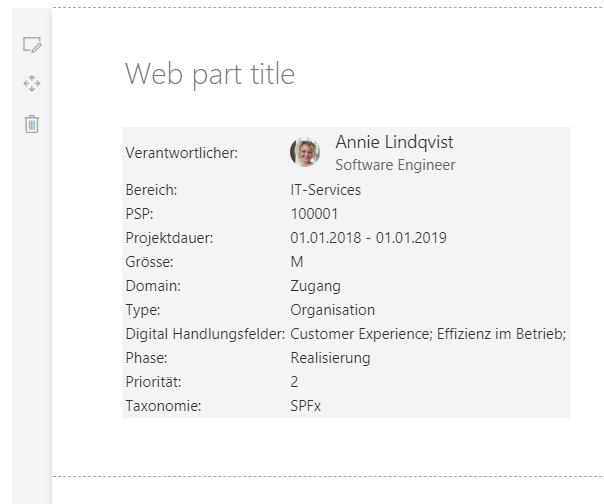
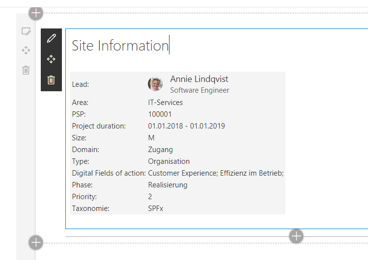
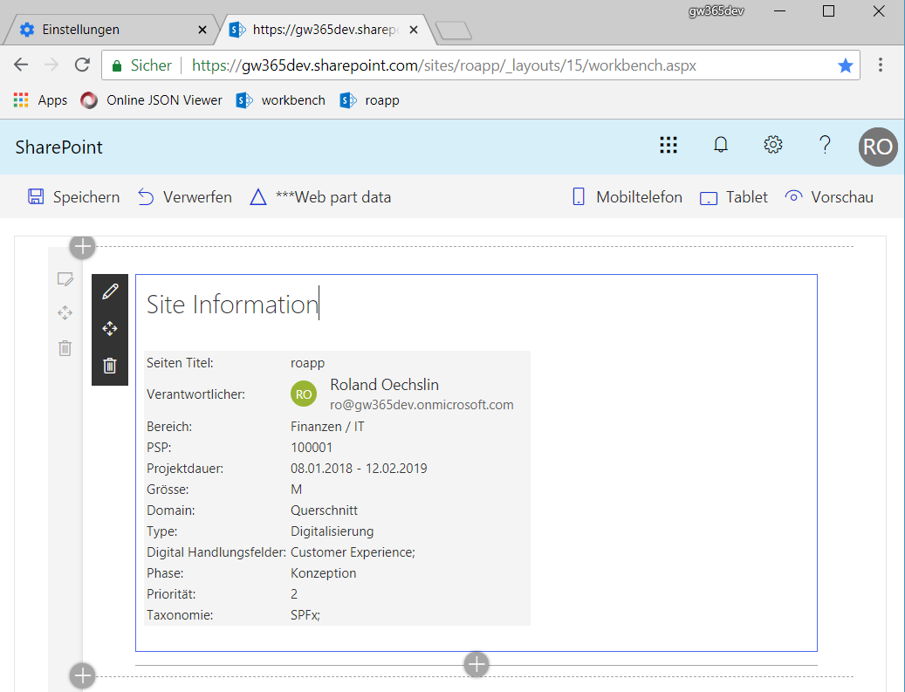

# SPFx Konzepte anhand eines Beispiels

Aufzeigen von diversen Spfx WebPart Konzepten und ihre Umsetzungen im Code.

## Mockdaten

Anzeige von Mockdaten wenn der local server gestartet wird.


[Code Switch Enviroment](https://stash.garaio.com/projects/SPFX/repos/spfxdevcamp2018/browse/src/webparts/siteMetaCard/SiteMetaCardWebPart.ts#35)

[Code Service](https://stash.garaio.com/projects/SPFX/repos/spfxdevcamp2018/browse/src/shared/services/ListMock.ts#523)

## Load data icon

Anzeige eines "Load data..." Icons, wenn der Datenzugriff erfolgt, sobald diese geladen sind, sollen die Daten angezeigt werden.


[Code](https://stash.garaio.com/projects/SPFX/repos/spfxdevcamp2018/browse/src/webparts/siteMetaCard/components/SiteMetaCard.tsx#80)

## Lokalisierung des WebParts

Umschalten der Sprache.



```bs
gulp serve --locale=de-de
```

[Code](https://stash.garaio.com/projects/SPFX/repos/spfxdevcamp2018/browse/src/shared/components/MetaCard/loc)

## Inline editieren des Titels

Der Titel des Webparts kann editiert werden ohne die WebPart Properties zu öffnen.



[Code](https://stash.garaio.com/projects/SPFX/repos/spfxdevcamp2018/browse/src/webparts/siteMetaCard/components/SiteMetaCard.tsx#135)

## WebPart Konfiguration

Anzeige von WebPart Properties, wie die Darstellung veränder werden kann zur Laufzeit.


[Code](https://stash.garaio.com/projects/SPFX/repos/spfxdevcamp2018/browse/src/webparts/siteMetaCard/SiteMetaCardWebPart.ts#66)

## Laden von Sharepoint List Daten

Anzeige eines Listitems aus einer Liste mithilfe der Library https://github.com/pnp/pnpjs. Bei komplexen Lookup oder Taxonomie Felder liefert die Funktion renderListDataAsStream() alle Daten zurück.



```bs
gulp serve --nobrowser --locale=de-de
```

[Code](https://stash.garaio.com/projects/SPFX/repos/spfxdevcamp2018/browse/src/shared/services/SpListService.ts#27)
