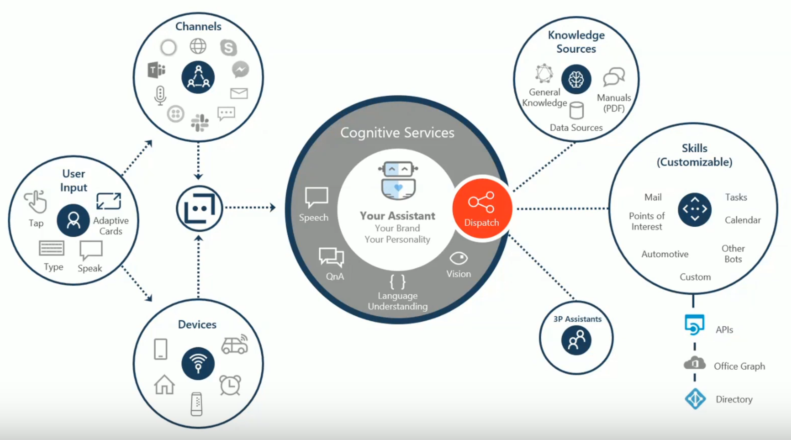

# BOT

- [building-a-microsoft-teams-bot](https://www.delucagiuliano.com/building-a-microsoft-teams-bot/#.Wq9HWqjwZBA)
- https://www.cloudguy.pro/learn-to-bot
- [Integrating Bot Framework v4 bots to SharePoint using SharePoint Framework](https://www.youtube.com/watch?v=NYICQINeUFU&feature=youtu.be&t=2531)

## Bot Framework & Cognitive Service

## AI

- [Microsoft Build 2019 updates on Conversational AI ](https://bisser.io/microsoft-build-2019-updates-on-conversational-ai/)

## QnA Makers

- [QnA Maker Lessons Learned + Limits Infographic](https://bisser.io/qna-maker-lessons-learned-limits-infographic/)

## Samples

- [Add AtBot to your SharePoint site using SPFx](https://blog.getbizzy.io/add-bizzy-to-your-sharepoint-site-using-spfx-ab7ed97b856c)
- [Github Source - AtBot Protype](https://github.com/withum-digital/directline-bot-extension)
- [Microsoft Bot Framework Web Chat](https://github.com/SharePoint/sp-dev-fx-webparts/tree/master/samples/react-bot-framework)
- [react-chat-widget](https://github.com/Wolox/react-chat-widget)
- [spfx-react-bot-qna](https://github.com/juanjoarranz/spfx-react-bot-qna)
- [Search for your SharePoint content from a bot using the Bot Framework, OAuth2 and Node.js](http://thecollaborationcorner.com/2017/01/25/search-for-your-sharepoint-content-from-a-bot-using-the-bot-framework-oauth2-and-node-js/)
- [SPFx MSAL Bot Extension](https://github.com/SharePoint/sp-dev-fx-extensions/tree/master/samples/react-msal-bot)
- [Bot Framework v4 SPFX Web Part Released](https://bisser.io/bot-framework-v4-spfx-web-part-released/)
- [react-bot-framework](https://github.com/SharePoint/sp-dev-fx-webparts/tree/master/samples/react-bot-framework)