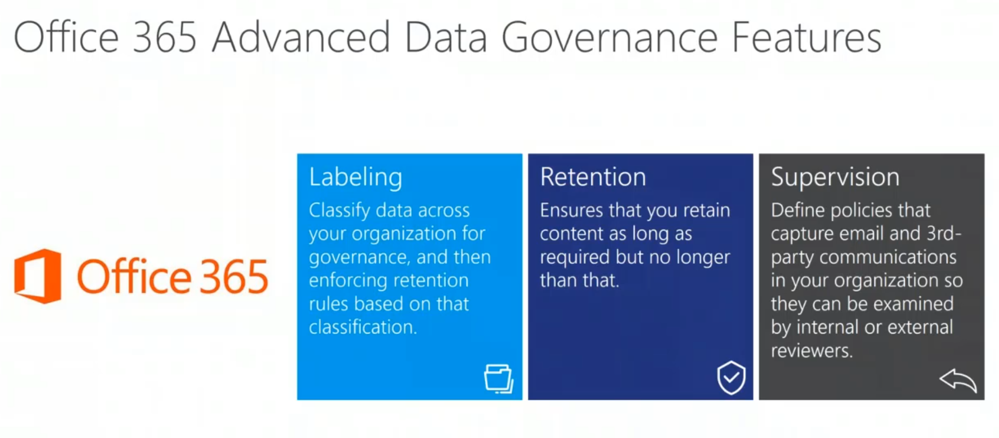

# Governance

## Collaboration

- [Planning intranet governance](https://docs.microsoft.com/en-us/sharepoint/intranet-governance)
- [Overview of collaboration governance in Microsoft 365](https://docs.microsoft.com/en-au/microsoft-365/solutions/collaboration-governance-overview?view=o365-worldwide)
- [Groups services interactions](https://docs.microsoft.com/en-au/microsoft-365/solutions/groups-services-interactions?view=o365-worldwide)

## Overview

- [SharePoint governance questions](http://tiny.cc/SharePointGovQuestions)
- [Plan for governance in Office 365 Groups](https://docs.microsoft.com/en-us/office365/admin/create-groups/plan-for-groups-governance?view=o365-worldwide)
- [Plan for governance to transform teamwork with Microsoft 365](https://resources.techcommunity.microsoft.com/teamwork-governance/)
- [How to implement SharePoint Governance](https://sharepointmaven.com/implement-sharepoint-governance)
- [overview-best-practices-for-managing-how-people-use-your-team-site](https://support.office.com/en-us/article/overview-best-practices-for-managing-how-people-use-your-team-site-95e83c3d-e1b0-4aae-9d08-e94dcaa4942e#__toc259623125)
- [Naming policy features](https://docs.microsoft.com/en-us/azure/active-directory/users-groups-roles/groups-naming-policy?_lrsc=018aa503-3b80-4738-a978-9d1164b944c8)
- [The Ultimate SharePoint Governance Template](https://sharepointmaven.com/the-ultimate-sharepoint-governance-template/)
- [Office 365 Group Naming Policy: Deciding if it’s Right For You](https://www.jamielaporte.com/home/2019/9/17/considerations-a-quick-overview-on-office-365-groups-naming-policies-for-2019)
- [8 Ways to Create Office 365 Groups – Overview and Differences](https://www.syskit.com/blog/8-ways-to-create-office-365-groups-understand-differences)

## Information Architecture

- [Information architecture in modern SharePoint](https://docs.microsoft.com/en-us/sharepoint/information-architecture-modern-experience)
- [One Size Does Not Fit All](https://tahoeninjas.blog/2019/02/18/information-architecture-in-sharepoint-one-size-does-not-fit-all/)
- [3 Dimensions of IA](https://tahoeninjas.blog/2019/02/20/information-architecture-in-sharepoint-3-dimensions-of-ia/)
- [The Logical Dimension](https://tahoeninjas.blog/2019/02/22/information-architecture-in-sharepoint-the-logical-dimension/)
- [The Metadata Dimension](https://tahoeninjas.blog/2019/02/24/information-architecture-in-sharepoint-the-metadata-dimension/)
- [Content Type Hub. What’s vNext](https://joannecklein.com/2018/11/08/content-type-hub-whats-vnext/)

## SharePoint Home Site

- [SharePoint Home, Hub, Sites, Start… What?](https://www.koskila.net/sharepoint-home-sharepoint-hub-sharepoint-sites-sharepoint-start-what/)
- [SHAREPOINT HOME SITES AND HUBS: A PRIMER](https://blog.splibrarian.com/2019/06/10/sharepoint-home-sites-and-hub-sites-a-primer/)

## Content Type

- [Content Type Benefits in Modern SharePoint](https://www.valointranet.com/blog/general/content-type-benefits-in-modern-sharepoint)
- [CHOICE, LOOKUP OR MANAGED METADATA?](https://joannecklein.com/2016/06/21/choice-lookup-or-managed-metadata/)
- [BUILD TARGETED TRAINING ON OFFICE 365 ADOPTION CENTER](https://joannecklein.com/2017/12/13/targeted-training-on-office-365-adoption-center-build)
- [BUILD A MODERN COMPANY LOCATIONS PAGE IN MINUTES](https://joannecklein.com/2018/06/26/build-a-modern-company-locations-page-in-minutes)
- [CONTENT TYPE FILTERS IN MODERN SHAREPOINT](https://joannecklein.com/2018/09/12/content-type-filters-in-modern-sharepoint)
- [MULTIPLE LIBRARIES, FOLDERS OR METADATA](https://joannecklein.com/2017/03/22/multiple-libraries-folders-or-metadata)

## ImageMap

-[Create Simple ImageMap in SPO](https://tracyvanderschyff.com/2019/05/09/how-to-create-image-maps-with-hotspots-in-sharepoint-online/)

## Permission

- [28 REASONS WHY MODERN SHAREPOINT ONLINE SITE PERMISSIONS ARE A HOT MESS](http://www.letscollaborate.co.za/28-reasons-why-modern-sharepoint-online-site-permissions-are-a-hot-mess)
- [Sharing and permissions in the SharePoint modern experience](https://docs.microsoft.com/en-us/sharepoint/sharing-permissions-modern-experience)
- [How Broken Are Office 365 SharePoint Permissions](https://en.share-gate.com/blog/how-broken-are-office-365-sharepoint-permissions)
- [Azure AD Internal - GDPR Tool](http://o365blog.com/post/aadinternals/)
- [Making a real world sharing strategy for SharePoint, OneDrive & Teams](https://www.slideshare.net/dmadelung/making-a-real-world-sharing-strategy-for-sharepoint-onedrive-teams)
- [SharePoint Modern Sites permission difference handling (Communication versus Teamsite)](https://williamvanstrien.blogspot.com/2020/04/sharepoint-governance-complicated-due.html)
- [MS Teams Channel / SharePoint permission inconsistency](https://williamvanstrien.blogspot.com/2020/05/ms-teams-channels-yet-another.html)
- [Modern Authentication](https://codemag.com/Article/2005021/Modern-Authentication)

## External Sharing

- [A quick guide to secure Office 365_DE.pdf](http://www.sharepointtalk.net/2018/07/a-quick-guide-to-secure-office-365.html)
- [Coaching your users through the External Sharing Experience](http://www.sharepointtalk.net/2019/01/coaching-your-users-through-external.html)
- [How to secure external sharing in SharePoint Online and Office 365](https://sharegate.com/blog/how-to-secure-external-sharing-sharepoint-online-onedrive-office-365)
- [Change External Sharing Settings Across a Hub Site with PowerShell](https://vladtalkstech.com/2019/03/change-external-sharing-settings-across-a-hub-site-with-powershell.html)
- [Microsoft 365 guest sharing settings reference](https://learn.microsoft.com/en-us/microsoft-365/solutions/microsoft-365-guest-settings?view=o365-worldwide)
- [How to properly configure sharing settings in the SharePoint Admin Center](https://sharepointmaven.com/how-to-properly-configure-sharing-settings-in-the-sharepoint-admin-center/)
- [Export Office 365 External User Reports for Secure External Collaboration](https://o365reports.com/2023/06/30/export-office-365-external-user-reports-for-secure-external-collaboration/)

## Organization Asset Libraries

- [SharePoint Organization Asset Libraries Explained](https://mattipaukkonen.com/2019/09/26/sharepoint-organization-asset-libraries-explained/)
- [Enable Organization assets on SharePoint Online](https://sharepoint-tricks.com/enable-organization-assets-on-sharepoint-online/)
- [How to create an Organisation Assets library in SharePoint Online to store Office Templates](https://ian-moran.com/2020/01/31/how-to-create-an-organisation-assets-library-in-sharepoint-online-to-store-office-templates/)
- [Use SharePoint Libraries to distribute Office Templates and Company images](https://tchinnin.com/sharepoint-organization-asset-libraries/)

## User profile / Delete user

- [User Profile Automated Removal when User is Deleted from Active Directory](http://nikcharlebois.com/user-profile-automated-removal-when-user-is-deleted-from-active-directory/)

## External user

- [4 ways to setup external users in SharePoint](https://sharepointmaven.com/setup-external-users-sharepoint)

## SiteCollections versus SubSites

- [ADVANTAGES OF A FLAT SHAREPOINT SITE ARCHITECTURE](https://joannecklein.com/2017/11/03/sharepoint-site-collection-advantages)
- [Benefits to creating a flat site structure](https://sharegate.com/blog/sharepoint-information-architecture-benefits-flat-site-structure)

## Tips Creating Sites

- [Exploring creating SharePoint TeamSites using SiteDesign and the REST API](https://www.mcd79.com/2018/07/21/exploring-creating-sharepoint-teamsites-using-sitedesign-and-the-rest-api.html)
- [Balancing Self-Service with Governance and Control in Office 365](http://bostonmusicdave.com/balancing-self-service-with-governance-and-control-in-office-365/)

## Backup

- [Does Office 365 require a backup solution?](https://blog.ioz.ch/backup-office-365/)
- [Compare Backup Solutions SkyKick and Veeam](https://blog.ioz.ch/office365-backup-skykick-und-veeam-im-vergleich/)
- [Does Office 365, hosted by Microsoft requires a data backup solution](https://www.sharepointeurope.com/office-365-hosted-microsoft-requires-data-backup-solution)

## Audit/Usage Reports Scripts

- [Admindroid - Office 365 Management Made Easy](https://admindroid.com/)
- [6 ways to check SharePoint Usage reports](https://sharepointmaven.com/6-ways-check-sharepoint-usage-reports/)
- [How to audit employees in SharePoint Online and Office 365](https://sharepointmaven.com/audit-employees-sharepoint-online-office-365/)
- [Get SPO sites with filter using SPOSitePropertiesEnumerableFilter](https://blogs.technet.microsoft.com/sharepointdevelopersupport/2018/10/24/get-spo-sites-with-filter-using-spositepropertiesenumerablefilter)
- [Retrieve Office 365 Audit logs using PowerShell and store in Azure table for quick retrieval](https://asishpadhy.com/2018/12/21/retrieve-office-365-audit-logs-using-powershell-and-store-in-azure-table-for-quick-retrival/)
- [Office 365 Groups and Teams Activity Report - obsolete groups](https://gallery.technet.microsoft.com/Check-for-obsolete-Office-c0020a42)
- [Top 50 PowerShell Scripts for Microsoft 365 Admins](https://o365reports.com/2022/06/15/top-50-powershell-scripts-for-microsoft-365-admins/)
- [SPC18: What Options do You Have to Govern the Lifecycle of Office 365 Groups / Teams](https://github.com/wobba/espc18)
[Ignite2018GroupsGovernanceToolkit](https://github.com/martinagrom/Ignite2018GroupsGovernanceToolkit)
- [PowerShell scripts for Microsoft Office 365](https://github.com/martinagrom/Office365Scripts)
- [Useful PowerShell cmdlets to administer Office 365 Groups – Part 1](https://blog.hubfly.com/office-365/useful-powershell-cmdlets-to-administer-office-365-groups-part-1)
- [Useful PowerShell cmdlets to administer Office 365 Groups – Part 2](https://blog.hubfly.com/office-365/useful-powershell-cmdlets-to-administer-office-365-groups-part-2)
- [THR2131 - Three PowerShell reports every Office 365 admin needs to have](https://github.com/vladcatrinescu/Ignite-2018/tree/master/THR2131)
- [Manage your SharePoint Team Sites to Excel](http://sharepoint-tricks.com/manage-your-sharepoint-team-sites/)
- [Extract information of Communication sites to Excel](http://sharepoint-tricks.com/extract-communication-sites-to-excel/)
- [Five-PowerShell-Reports-For-Office365](https://github.com/vladcatrinescu/Five PowerShell Reports For Office365)
- [ADEssentials - AzureAD Reporting](https://github.com/EvotecIT/ADEssentials)
- [M365 Powershell Reporting Scripts](https://github.com/michevnew/PowerShell)
- [Microsoft Replaces User Data Search with Standard eDiscovery](https://office365itpros.com/2023/08/14/user-data-search-replaced)
- [Azure AD audit logs latency](https://www.michev.info/blog/post/5749/microsoft-365-azure-ad-audit-logs-and-reports-latency-data)

## AD Mistakes

- [Most Common Mistakes in Active Directory and Domain Services – Part 1](https://blogs.technet.microsoft.com/meamcs/2018/12/31/most-common-mistakes-in-active-directory-and-domain-services-part-1/)
- [Most Common Mistakes in Active Directory and Domain Services – Part 2](https://blogs.technet.microsoft.com/meamcs/2019/01/08/most-common-mistakes-in-active-directory-and-domain-services-part-2/)
- [Most Common Mistakes in Active Directory and Domain Services - Part 3](https://blogs.technet.microsoft.com/meamcs/2019/01/27/most-common-mistakes-in-active-directory-and-domain-services-part-3)

## Handling Teams and Groups

- [Governance and consciousness around handling Teams and Groups](https://www.techmikael.com/2019/03/governance-and-consciousness-around.html)
- [Three reasons why you should take control of Office 365 Groups creation](https://www.techmikael.com/2017/05/three-reasons-why-you-should-take.html)
- [Automating Office 365 Groups Lifecycle/Expiration management](https://www.techmikael.com/2018/01/automating-office-365-groups.html)
- [Stop using Power Automate to govern Microsoft Teams](https://baddaz.com/stop-using-power-automate-to-govern-microsoft-teams-30460cea6f10)
- [Microsoft Teams Naming Best Practices](https://www.orchestry.com/insight/fundamentals/ms-teams-tips-and-tricks/microsoft-teams-naming-best-practices/)

## Tips

- [SharePoint Online Can Now Rename Site URLs](https://office365itpros.com/2019/05/02/sharepoint-online-rename-site-names/)

## SAM

- [A primer on SharePoint Advanced Management](https://wbaer.net/2023/04/a-primer-on-sharepoint-advanced-management/)
- [Govern and Secure SharePoint and OneDrive with Microsoft Syntex – SharePoint Advanced Management](https://antonio365.com/govern-and-secure-sharepoint-and-onedrive-with-microsoft-syntex-sharepoint-advanced-management/)

## Security and Compliance - DLP

- [Overview of data loss prevention](https://docs.microsoft.com/en-us/microsoft-365/compliance/data-loss-prevention-policies?view=o365-worldwide)
- [Security and Compliance - DLP - Notes](https://techcommunity.microsoft.com/t5/microsoft-security-and/mip-notes-from-the-field/ba-p/1501297)
- [Compliance Customer Experience Engineering (CxE)](https://microsoft.github.io/ComplianceCxE/)

## Records Management (RM)

- [Managing and applying Purview retention labels using code](https://www.blimped.nl/managing-and-applying-purview-retention-labels-using-code)
- [Working with Purview event-based retention using code](https://www.blimped.nl/working-with-purview-event-based-retention-using-code)
- [Finding incorrectly applied Purview retention labels](https://www.blimped.nl/finding-and-fixing-incorrectly-applied-purview-retention-labels)
- [Implications of applying Purview retention labels to folders](https://www.blimped.nl/implications-of-applying-purview-retentionlabels-to-folders/)
- [Compliance Customer Experience Engineering (CxE) - (MIG/RM)](https://microsoft.github.io/ComplianceCxE/dag/mig-rm/)
- [Understanding Compliance and Records Management in Office 365- Video](https://www.youtube.com/watch?v=Sv1Pt0DiEDw)
- [A Complete Guide to Office 365 Retention! - Video](https://www.youtube.com/watch?v=cYy6qy8LT2Y)
- [MIGScripts](https://brenle.github.io/MIGScripts/)
- [Microsoft 365 Compliancefeatures](https://go.microsoft.com/fwlink/?linkid=2139145)
- [MIP and compliance capabilities - illustrations](https://docs.microsoft.com/en-us/microsoft-365/solutions/productivity-illustrations?view=o365-worldwide#microsoft-365-information-protection-and-compliance-capabilities)

### Practise (German)

- [Datensatzverwaltung in Microsoft 365](https://docs.microsoft.com/de-de/microsoft-365/compliance/records-management?view=o365-worldwide#records)
- [Versionsverwaltung zur Aktualisierung von Datensätzen verwenden](https://docs.microsoft.com/de-de/microsoft-365/compliance/record-versioning?view=o365-worldwide)
- [Datenschutzressourcen](https://servicetrust.microsoft.com/ViewPage/TrustDocuments)

### Practise (English)

- [Lifecycle of an item in SharePoint: Where does it go?](https://laptrinhx.com/lifecycle-of-an-item-in-sharepoint-where-does-it-go-1944369039/)
- [Use retention labels to manage the lifecycle of documents stored in SharePoint](https://docs.microsoft.com/en-us/microsoft-365/compliance/auto-apply-retention-labels-scenario?view=o365-worldwide)
- [RETENTION IN SHAREPOINT ONLINE: THE WHERE, WHAT, HOW, AND WHEN](https://joannecklein.com/2020/03/25/retention-in-sharepoint-online-the-where-what-and-how/)

- [ROLE TOUCHPOINTS DURING INFORMATION GOVERNANCE AND RECORDS MANAGEMENT IMPLEMENTATION](https://joannecklein.com/2022/01/09/role-touchpoints-during-information-governance-and-records-management-implementation/)
