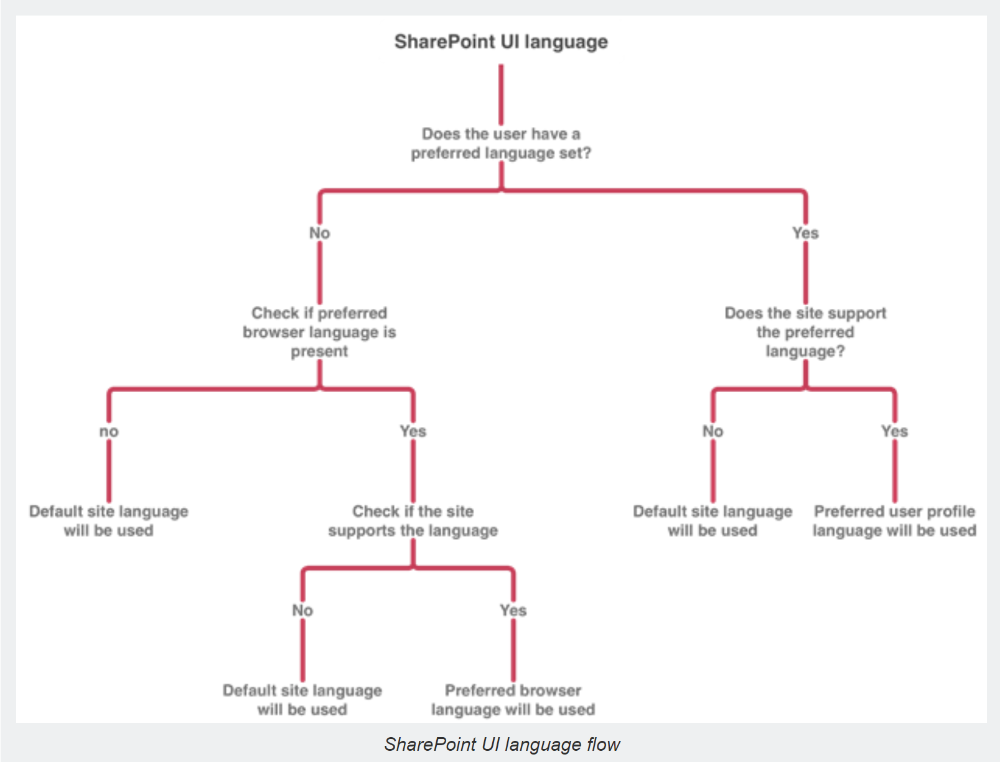

# MUI

## Multilingual Pages

- [Multilingual publishing for pages and news posts](https://techcommunity.microsoft.com/t5/microsoft-sharepoint-blog/new-sharepoint-feature-multilingual-publishing-for-pages-and/ba-p/1432445)

## Localisation of the user interface

- [Understanding the Multilingual User Interface (MUI)](https://docs.microsoft.com/en-us/previous-versions/office/developer/sharepoint-2010/ff800886(v=office.14))
- [Demystifying the mystery behind the UI language in SharePoint](https://www.eliostruyf.com/demystifying-the-mystery-behind-the-ui-language-in-sharepoint)



## Definition Multilingual Intranet

- [MULTILINGUAL AND MODERN SHAREPOINT](https://joannecklein.com/2018/10/05/multilingual-and-modern-sharepoint/)
- [Building Multilingual SharePoint views using SPFx Field Customizers](https://www.aerieconsulting.com/blog/building-multi-lingual-sharepoint-views)
- [SharePoint Online Multi-language Modern Sites – real case, pros and cons](https://devscopeninjas.azurewebsites.net/2019/01/29/sharepoint-online-multi-language-modern-sites-real-case-pros-and-cons/)
- [SharePoint Localization – a (somewhat) comprehensive how-to!](https://www.koskila.net/how-to-sharepoint-localization/)
- [Creating a Multi-lingual Intranet using Communication Sites](https://capacreative.co.uk/2018/11/18/series-creating-a-multi-lingual-intranet-using-communication-sites/)
- [CUSTOMIZE SHAREPOINT MODERN PAGES USING MICROSOFT FLOW](http://www.sites.se/2018/08/sharepoint-modern-pages-microsoft-flow/)
- [Using the SFPx library component for simplifying the localization experience](https://www.eliostruyf.com/sfpx-library-component-simplifying-localization-experience/)
- [Webinar Recording: Deep Dive into SharePoint Multilingual with Divyachapan (DC) Padur](https://www.youtube.com/watch?v=Xwxhi4CY0_E&feature=youtu.be)
- [Using the new multilingual APIs in Modern SharePoint](https://www.eliostruyf.com/multilingual-apis-modern-sharepoint/)
- [Working with SharePoint Online modern multilingual with the search Keyword Query Language, Query variables and the modern search webpart](https://mahmoudhhassan.wordpress.com/2020/04/12/working-with-sharepoint-online-modern-multilingual-with-the-search-keyword-query-language-query-variables-and-the-modern-search-webpart/)
- [7 tips to help create and manage multilingual SharePoint communication sites](https://www.computerworld.com/article/3562354/7-tips-to-help-create-and-manage-multilingual-sharepoint-communication-sites.html)

Search Query for multilingual news

```Powershell
PromotedState:2 AND (SPTranslationLanguage:{CurrentDisplayLanguage} OR (NOT SPTranslatedLanguages:{CurrentDisplayLanguage} AND NOT SPIsTranslation:true))
```

## Samples

- [Multilingual Pages](https://github.com/SharePoint/sp-dev-solutions/tree/master/solutions/MultilingualPages)
