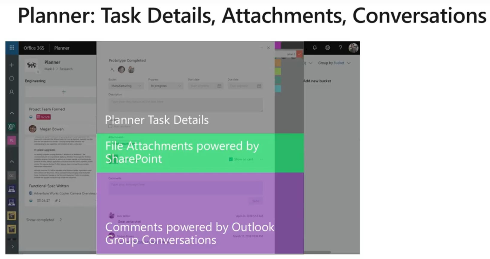

# Planner

## Planer API

- [Create plans, buckets, and tasks in Planner](https://developer.microsoft.com/en-us/graph/blogs/30daysmsgraph-day-21-use-case-create-plans-buckets-and-tasks-in-planner/)
- [Use the Planner REST API](https://docs.microsoft.com/en-us/graph/api/resources/planner-overview?view=graph-rest-1.0)

## Support

- [Microsoft Planner for admins](https://support.office.com/en-us/article/microsoft-planner-for-admins-9652e4c7-48e3-4dad-9e71-0c783ec3d0f8#bkmk_howdoiturnoffplannerformyrganization)

## Creating Planner

- [Creating a Planner with Flow](https://daytodaydynamics365.com/creating-a-planner-plan-from-a-d365-psa-project-with-flow/)
- [A Change Management Solution for Office 365](https://techcommunity.microsoft.com/t5/Planner-Blog/Microsoft-Planner-A-Change-Management-Solution-for-Office-365/ba-p/362360)
-[Office 365 Message Center to Planner](https://techcommunity.microsoft.com/t5/Planner-Blog/Office-365-Message-Center-to-Planner-PowerShell-walk-through-amp/ba-p/362363)
- [Github - O365 Message Center to Planner integration](https://github.com/LunchWithaLens/R-CSA325)
- 
- [Duplicate Microsoft Planner Plans](https://lazyadmin.nl/powershell/duplicate-microsoft-planner-plan/)

## Powershell Module

- [Getting started with Microsoft Graph and PowerShell](https://www.lee-ford.co.uk/getting-started-with-microsoft-graph-with-powershell/)
- [PowerShell and the Microsoft Graph API : Part 1, signing in](https://jamesone111.wordpress.com/2019/02/28/powershell-and-microsoft-graph-api-part-1-signing-in/)
- [PowerShell and the Microsoft Graph API : Part 2 – Starting to explore](https://jamesone111.wordpress.com/2019/03/03/powershell-and-the-microsoft-graph-api-part-2-starting-to-explore/)
- [PowerShell formatting [not just] Part 3 of the Graph API series](https://jamesone111.wordpress.com/2019/03/06/powershell-formatting-not-just-part-3-of-the-graph-api-series/)
- [MsftGraph](https://www.powershellgallery.com/packages/MSFTGraph/1.0.1)
- [Unified PowerShell experience for Microsoft Graph](https://myignite.techcommunity.microsoft.com/sessions/83012?source=sessions)

## Blogs

- [MS Planner Blog](https://techcommunity.microsoft.com/t5/Planner-Blog/bg-p/PlannerBlog)
- [HOW TO SORT PLANNER TASKS USING ORDER HINT AND MICROSOFT GRAPH](https://laurakokkarinen.com/how-to-sort-tasks-using-planner-order-hint-and-microsoft-graph/)

## Video

- [Planner APIs in Microsoft Graph](https://www.youtube.com/watch?v=YmYVhfRBicg)

## Planner Architecture

## Tips

- [Make Sure to Add Owners as Members When Creating New Teams](https://office365itpros.com/2018/11/23/creating-teams-powershell/)
- [Planner Does Multiplan](https://www.petri.com/planner-does-multiplan)
- [Planner Supports Export to Excel](https://www.petri.com/planner-export-to-excel)

## Tools / Frameworks

- [Apps4.Pro Planner Manager](https://apps4.pro/planner-manager-resources.aspx)
- [DHTMLX](https://github.com/DHTMLX/react-gantt-demo)
- [react-jsgantt](https://github.com/jsGanttImproved/react-jsgantt)