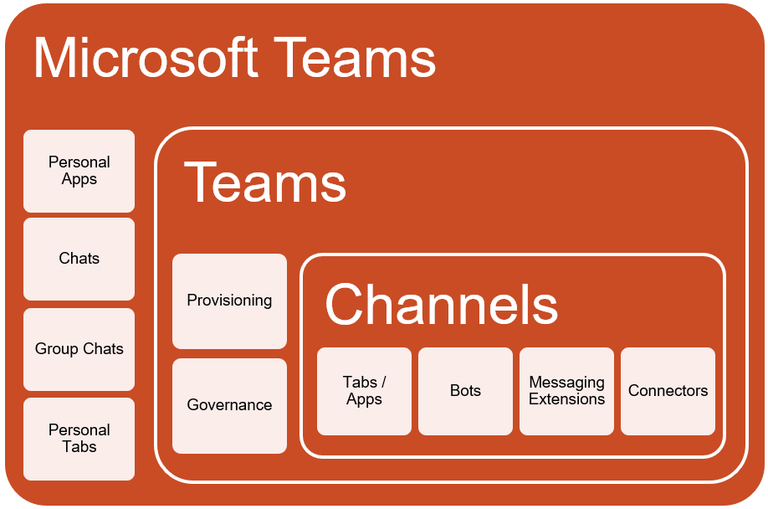
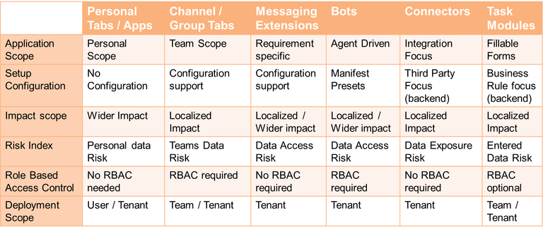
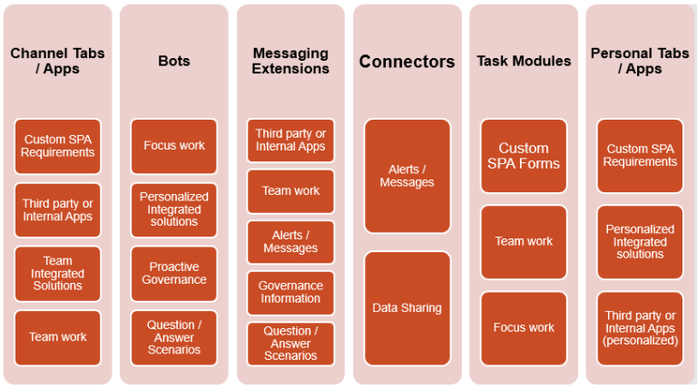

# Teams

- [An Everyday Guide to Office 365 Groups](https://www.jumpto365.com/infographics/everyday-guide-to-office-365-groups)
- [Microsoft Teams Platform Architecture Overview with Teams Founder, Bill Bliss](https://www.youtube.com/watch?v=I33pQ9PUHNc)
- [Microsoft Teams developer documentation](https://docs.microsoft.com/en-us/microsoftteams/platform/)

## Start Developing

- [Prepare your Microsoft 365 tenant](https://docs.microsoft.com/en-us/microsoftteams/platform/concepts/build-and-test/prepare-your-o365-tenant)

## Support

- [Keyboard shortcuts for Microsoft Teams](https://support.office.com/en-us/article/keyboard-shortcuts-for-microsoft-teams-2e8e2a70-e8d8-4a19-949b-4c36dd5292d2?utm_source=t.co&utm_medium=referral)
- [Microsoft Teams: How to clean cache](https://albandrodsmemory.wordpress.com/2019/01/04/microsoft-teams-how-to-clean-cache/)
- [A guide to troubleshooting Teams](https://sharepointstuff621190718.wordpress.com/2019/09/17/a-guide-to-troubleshooting-teams/)

## Overview

- [All-in-One Collaboration](http://blog.ioz.ch/productivity-news-vom-1-3-2017-microsoft-teams-all-in-one-collaboration)
- [Teams and SharePoint: Better Together](https://bob1german.com/2018/05/14/teams-and-sharepoint-better-together)
- [Everything You Need to Know About Microsoft Teams](https://www.quest.com/community/quest/microsoft-platform-management/b/microsoft-platform-management-blog/posts/getting-started-everything-you-need-to-know-about-microsoft-teams)
- [Inner Loop & Outer Loop](https://blog.ioz.ch/was-es-mit-inner-loop-outer-loop-auf-sich-hat-und-worin-sich-teams-und-yammer-unterscheiden/)

## Planing

- [Modern Governance für SharePoint Team Sites sind zu beachten](https://blog.ioz.ch/modern-governance-fuer-sharepoint-team-sites-8-punkte-gilt-es-zu-beachten/)
- [Microsoft Teams planning guide](https://docs.microsoft.com/en-us/MicrosoftTeams/quick-start-enable-teams)
- [Core components of Teams](https://www.youtube.com/watch?v=xJBvJTDiQqg)
- [Limits and specifications for Microsoft Teams](https://docs.microsoft.com/en-us/MicrosoftTeams/limits-specifications-teams)
- [Difference in permission between an owner and a member](https://docs.microsoft.com/en-us/MicrosoftTeams/assign-roles-permissions)

## Training video

- [Microsoft Teams video training](https://support.office.com/en-us/article/microsoft-teams-video-training-4f108e54-240b-4351-8084-b1089f0d21d7?ui=en-US&rs=en-US&ad=US)
- [Governance, management and lifecycle in Microsoft Teams](https://www.youtube.com/watch?v=cOCWDYc_HLs&feature=youtu.be)

## Developing

- [Build apps for Microsoft Teams](https://docs.microsoft.com/de-de/microsoftteams/platform/overview)
- [Overview and Concepts - Part 1](https://asishpadhy.com/2020/01/16/simplify-development-in-microsoft-teams-part-1-overview-and-concepts/)



- [Features and Components analysis - Part 2](https://asishpadhy.com/2020/02/05/simplify-building-apps-in-microsoft-teams-part-2-features-and-components-analysis/)




## Coding

- [A Yeoman Generator for Microsoft Teams](https://github.com/wictorwilen/generator-teams)
- [Get started with Teams templates](https://docs.microsoft.com/en-us/MicrosoftTeams/get-started-with-teams-templates)
- [App Templates for Microsoft Teams](https://docs.microsoft.com/en-us/microsoftteams/platform/samples/app-templates?WT.mc_id=-github-rogerman#expert-finder)

## Deployment

- [How to deploy a Yo Teams generated project to Azure through Azure DevOps](https://www.wictorwilen.se/blog/deploying-yo-teams-and-node-apps/)

## Message Extensions

- [Where to start developing your messaging extension using Microsoft Teams Toolkit](https://rabiawilliams.com/teams/message-extensions/)

## Personal Apps

- [Personal apps](https://docs.microsoft.com/en-us/microsoftteams/platform/concepts/design/personal-apps)
- [Building Microsoft Teams tab using SharePoint Framework - Tutorial](https://docs.microsoft.com/en-us/sharepoint/dev/spfx/web-parts/get-started/using-web-part-as-ms-teams-tab)
- [Create Microsoft Teams manifest manually for a web part and deploy it to Microsoft Teams](https://docs.microsoft.com/en-us/sharepoint/dev/spfx/web-parts/guidance/creating-team-manifest-manually-for-webpart)

## Administration

- [Overview of Teams](https://support.office.com/en-us/article/Frequently-asked-questions-about-Microsoft-Teams-%25E2%2580%2593-Admin-Help-05cbe533-2181-4e95-a4b0-52cd7695fafc?ui=en-US&rs=en-US&ad=US)
- [Which Office 365 Service to Use](http://blog.avanade.com/avanade-insights/collaboration/microsoft-teams-supercharges-collaboration-for-millennials-to-boomers/)
- [Selecting users for your Microsoft Teams pilot phase](https://delucagiuliano.com/selecting-users-for-your-microsoft-teams-pilot-phase/#.W1lo89IzZBA)
- [Top 10 Office 365 Best Practices Every Admin Should Know](https://blog.syskit.com/top-10-office-365-best-practices)
- [Getting Started with Microsoft Teams Administration](https://tracyvanderschyff.com/2019/10/02/getting-started-with-microsoft-teams-administration/)

## Guest Users

- <https://www.sharepointeurope.com/ultimate-admin-guide-to-microsoft-teams-guest-users>

## Teams Adviser

- [Overview Microsoft Teams Advisor](https://www.jamielaporte.com/home/2019/11/11/microsoft-teams-advisor)

## Microsoft Teams versus Sharepoint Teams

- <http://blog.intlock.com/microsoft-teams-vs-sharepoint-teams-enhance-collaboration-work>
- <https://www.avepoint.com/blog/microsoft-teams/office-365-groups-vs-teams/>
- <http://blog.pixelmill.com/3580/microsoft-teams-sharepoint-destined-lifelong-partners/>

## Private Channels

- [Top 5 things to know about private channels in Microsoft Teams](https://robertschouten.com/2019/11/04/top-5-things-to-know-about-private-channels-in-microsoft-teams/)

## Tipps

- <https://collab365.community/microsoft-teams-hacks>
- [Office 365 Groups Naming Policy](https://drewmadelung.com/office-365-groups-naming-policy)
- [Get Office 365 Groups with Teams via PowerShell and the Microsoft Graph](https://drewmadelung.com/get-office-365-groups-with-teams-via-powershell-and-the-microsoft-graph)
- https://laurakokkarinen.com/useful-things-to-do-with-graph-api-teams-operations
- [PowerShell scripts for manging Office 365 Groups and Microsoft Teams](https://github.com/martinagrom/Ignite-PowerShell-Masterclass)

## Querys / Reports

- [How to find inactive Microsoft Teams you no longer need](https://sharegate.com/blog/find-inactive-microsoft-teams-office-365-groups)
- [Get all Teams Groups](https://sharepoint-specialist.nu/get-all-teams-in-a-tenant-using-microsoft-graph-255f374d5c3a)
- [Get Office 365 Groups with Teams via PowerShell and the Microsoft Graph](https://drewmadelung.com/get-office-365-groups-with-teams-via-powershell-and-the-microsoft-graph/)

```html
https://graph.microsoft.com/beta/groups?$filter=resourceProvisioningOptions/Any(x:x eq 'Team')
```

## Blogs

- [http://drewmadelung.com](http://drewmadelung.com/tag/teams)

## Governance with teams

- [Automate governance in Microsoft Teams: Context and Goals](https://blog.yannickreekmans.be/automate-governance-in-microsoft-teams-context-and-goals/)
- [Automate governance in Microsoft Teams: The Result](https://blog.yannickreekmans.be/automate-governance-in-microsoft-teams-the-result/)
- [Automate governance in Microsoft Teams: Implementation, v1](https://blog.yannickreekmans.be/automate-governance-in-microsoft-teams-implementation-v1/)
- [Automate governance in Microsoft Teams: Implementation, v2](https://blog.yannickreekmans.be/automate-governance-in-microsoft-teams-implementation-v2/)

## DevOps

- [Create Azure DevOps pipelines for a Microsoft Teams app built with SPFx](https://www.vrdmn.com/2019/03/create-azure-devops-build-and-release.html)

## Provisioning with Template

- [Create Teams with template](https://www.sharepointnutsandbolts.com/2019/03/create-microsoft-teams-from-template.html)
- [Provisioning Teams with Azure Functions and Microsoft Flow Part 1: Solution Overview](https://bob1german.com/2019/03/12/provisioning-teams-with-azure-functions-and-microsoft-flow-part-1-solution-overview/)
- [Microsoft Teams – Automation of Teams Creation](https://www.robertjgates.com/microsoft-teams-automation-of-teams-creation/)
- [Provision Microsoft Teams with Azure Automation – Part I](https://mmsharepoint.wordpress.com/2019/03/22/provision-microsoft-teams-with-azure-automation-part-i/)

## Renaming Teams

- [Renaming Teams and Channels Can Be Messy](https://www.petri.com/renaming-teams-can-be-messy)
- [Renaming a Microsoft Team and the associated SharePoint site](https://www.cps.co.uk/blog-posts/renaming-a-microsoft-team-and-the-associated-sharepoint-site/)

## Teams for Education

- [Teams for Education, Fundamentals](https://blog.yannickreekmans.be/teams-for-education-fundamentals-april-2020/)

## Presenting in Teams

- [The right way to present a PowerPoint file during a Microsoft Teams meeting](https://www.jumpto365.com/blog/the-right-way-to-present-a-powerpoint-file-during-a-microsoft-teams-meeting)

## Dataverse

- [Overview of Microsoft Dataverse for Teams](https://docs.microsoft.com/en-us/powerapps/teams/overview-data-platform)
- [Reshape the future of work with Microsoft Dataverse for Teams](https://powerapps.microsoft.com/en-us/blog/reshape-the-future-of-work-with-microsoft-dataverse-for-teams-now-generally-available/)
 - [A Closer Look at Data Platform Capabilities in Project Oakdale](https://powerapps.microsoft.com/en-us/blog/a-closer-look-at-data-platform-capabilities-in-project-oakdale/)
 - [Manage Microsoft Dataverse for Teams environments](https://powerapps.microsoft.com/en-us/blog/manage-microsoft-dataverse-for-teams-environments/)