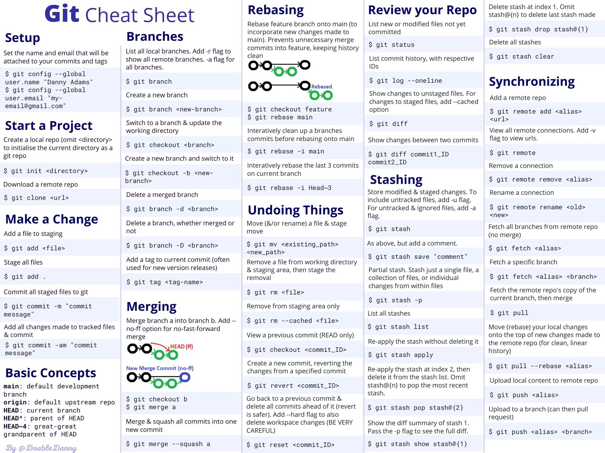

# Git

## Reference

- [Git Documentation](https://git-scm.com/docs)

## Cheatsheet

- [GIT CHEAT SHEET](https://education.github.com/git-cheat-sheet-education.pdf)



## Git for Tenant Admins


- [Source Control for Microsoft 365 Tenant Admins](https://practical365.com/source-control-for-microsoft-365-tenant-admins/)
- [Source Control for Microsoft 365 Tenant Admins: Part II](https://practical365.com/source-control-for-microsoft-365-tenant-admins-part-ii/)
- [Source Control for Microsoft 365 Tenant Admins: Part III](https://practical365.com/source-control-for-microsoft-365-tenant-admins-part-iii/)

## Learning

- [Github Skills](https://skills.github.com/)
- [My GitHub cheat sheet for PnP contributions](https://tahoeninjas.blog/2019/08/18/my-github-cheat-sheet-for-pnp-contributions-an-interactive-cheat-sheet/)
- [Git Fundamentals](https://app.pluralsight.com/library/courses/git-fundamentals/table-of-contents)
- [Git Real](https://www.pluralsight.com/courses/code-school-git-real)

## Tips

- [How to be more productive on GitHub](https://medium.freecodecamp.org/how-to-be-more-productive-on-github-c3cedab043e3)
- [How to write the perfect pull request](https://blog.github.com/2015-01-21-how-to-write-the-perfect-pull-request/)
- [Update a Severely Out of Date GitHub Repository Fork](https://mikefrobbins.com/2018/06/28/update-a-severely-out-of-date-github-repository-fork/)
- [Merging 2 Different Git Repositories Without Losing your History](https://thoughts.t37.net/merging-2-different-git-repositories-without-losing-your-history-de7a06bba804)
- [Push your code into a git repo](https://winsmarts.com/push-your-code-into-a-git-repo-2de18f61ee8f)
- [Keeping your fork up to date](https://garrytrinder.github.io/2020/03/keeping-your-fork-up-to-date)
- [7 Git Commands You May Not Know](https://scotch.io/bar-talk/7-lesser-known-git-commands)

## Rebase / Merge

- [An Introduction to Git Merge and Git Rebase: What They Do and When to Use Them](https://medium.freecodecamp.org/an-introduction-to-git-merge-and-rebase-what-they-are-and-how-to-use-them-131b863785f)

## Commit Guidlines

- [How We Do It - Keeping a Clean Commit Log](http://www.andrewconnell.com/blog/ngofficeuifabric-how-we-do-it-keeping-a-clean-commit-log)
- [How to Write a Git Commit Message](https://chris.beams.io/posts/git-commit/)

## Gitflow

- [Introducing GitFlow](https://datasift.github.io/gitflow/IntroducingGitFlow.html)

## Deleted File

```powershell
git log --full-history -- src/path/to/file.js
```

## GitHub

- [GitHub Doc](https://docs.github.com/en)

### GitHub Actions

- [Automate your CI/CD workflow using CLI for Microsoft 365 GitHub Actions](https://pnp.github.io/cli-microsoft365/concepts/github-actions/)
- [Deploy SPFx solutions on multiple sites using GitHub Actions and Office 365 CLI](https://aakashbhardwaj619.github.io/2020/06/09/GitHub-Actions-Multi-Deployment.html)
- [Create GitHub actions for SPFx solution](https://medium.com/@anoopt/create-github-actions-for-spfx-solution-cc4a810b87db)
- [GitHub Actions + Power Automate + Teams](https://anoopt.medium.com/github-actions-power-automate-teams-a46d7b643c7f)

## Git CLI

- [Git cli](https://cli.github.com/)
- [lazygit](https://github.com/jesseduffield/lazygit)
