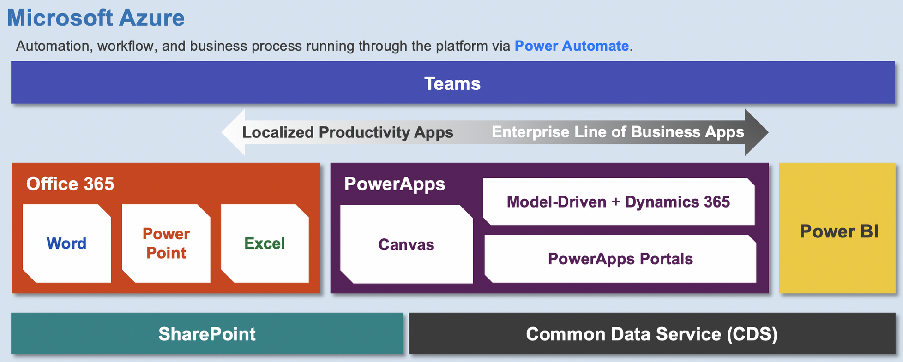
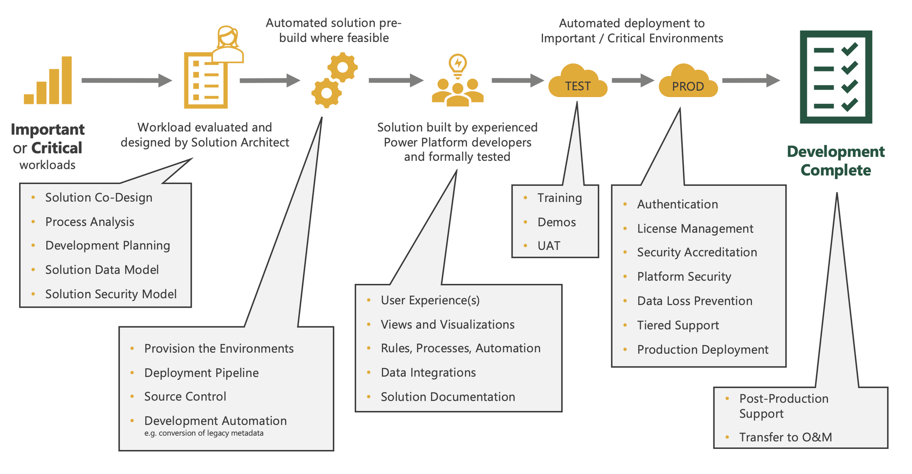

# PowerApps

- [Power Platform Basics - Layer](https://github.com/PowerPlatformAF/PowerPlatformAF/wiki/2-Power-Platform)

- [Power Platform Basics - Project Activities](https://github.com/PowerPlatformAF/PowerPlatformAF/wiki/6-Solution-Development#project-activities)

## Resources

- [Microsoft Power Platform guidance documentation](https://docs.microsoft.com/en-us/power-platform/guidance/)
- [Power Platform Training Materials](https://powerusers.microsoft.com/t5/Power-Apps-Community-Blog/Power-Platform-Training-Materials/ba-p/342088)
- [Power Wiki](https://techcommunity.microsoft.com/t5/microsoft-365-pnp-blog/init-api-permissions-for-your-spfx-projects-without-deploying/ba-p/2189059)
- [Microsoft Power Platform: Learning Resources](https://powerapps.microsoft.com/en-us/blog/microsoft-powerapps-learning-resources/)
- [A collection of awesome things regarding the Power Platform ecosystem](https://powerlist.page/)

## Frameworks

- [PowerApps Tools](https://github.com/microsoft/powerapps-tools)
- [5 Power Platform projects developers must know!](https://sharepains.com/2020/03/18/power-platform-projects-developers-must-know/)
- [Creator kit overview](https://docs.microsoft.com/en-us/power-platform/guidance/creator-kit/overview)
- [Powercat creator kit](https://github.com/microsoft/powercat-creator-kit)

## Video Tutorials

- [Youtube Microsoft PowerApps Channel](https://www.youtube.com/channel/UCGfWR2ekfRFckLjev6eQYLg/playlists)

## Price

- [Power Apps and Power Automate licensing FAQs](https://docs.microsoft.com/en-us/power-platform/admin/powerapps-flow-licensing-faq)
- [Power Apps pricing](https://emea.flow.microsoft.com/en-us/pricing/#plan-feature-table)
- [Licensing overview for Power Platform](https://docs.microsoft.com/en-us/power-platform/admin/pricing-billing-skus)
- [The comprehensive licensing guide to Microsoft Power Automate (formerly Flow) and Power Apps](https://jussiroine.com/2019/01/the-comprehensive-licensing-guide-to-microsoft-flow-and-powerapps/)
- [Power Platform Licensing QnA – Key takeaways](https://m365princess.com/power-platform-licensing-qna-key-take-aways/)
- [Power Platform licensing, November 2021 updates](https://jukkaniiranen.com/2021/11/power-platform-licensing-november-2021-updates/)
- [Power Apps Pricing Explained](https://d365update.com/power-apps-pricing-explained/)

## Performance / Connectors 

- [Considerations for optimized performance in Power Apps](https://powerapps.microsoft.com/en-us/blog/considerations-for-optimized-performance-in-power-apps/)

## WebParts

- [PowerApps web part for SharePoint Online](https://www.jijitechnologies.com/blogs/powerapps-webpart-sharepoint)

## Tipps

- [Tips for making your apps more maintainable](https://powerapps.microsoft.com/en-us/blog/tips-for-a-maintainable-extensible-app)
- [Embed PowerApps in Modern SharePoint Online Site Page](https://www.sharepointsky.com/embed-powerapps-in-sharepoint-online/)
- [Application Lifecycle Management](https://sharepains.com/2021/08/24/application-lifecycle-management/)
- [PowerApps source code editing for Canvas Apps](https://techcommunity.microsoft.com/t5/microsoft-365-pnp-blog/power-apps-source-code-editing-for-canvas-apps/ba-p/2256476?WT.mc_id=m365-24198-cxa)

## Samples

- [SharePoint PowerApps Solution samples](https://github.com/SharePoint/sp-powerapps-solutions/tree/master/solutions)
- [SharePoint custom forms and automated business workflow](https://resources.techcommunity.microsoft.com/business-applications-process/)
- [Flow provisioning with azure function and PNP template](https://sergeluca.wordpress.com/2017/08/01/microsoft-flow-provisioning-sharepoint-sites-applying-pnp-templates-and-waiting-for-completion-azure-function-flow-azure-queue)
- [SelfService Portal for Microsoft 365](https://github.com/pnp/powerapps-samples/tree/main/samples/selfservice-groups)

## Localization

- [Building multilingual apps in PowerApps](https://powerapps.microsoft.com/en-us/blog/building-multilingual-apps-in-powerapps/)

## Custom Forms

- [Getting started with custom forms in SharePoint build with PowerApps](https://www.youtube.com/watch?v=A9uZholjaHo)
- [How to Customize SharePoint list forms with Power Apps - Beginners Tutorial](https://www.youtube.com/watch?v=aFzd5qwS4-c&t=0s)
- [Customize SharePoint Document Library Form using Power Apps](https://www.youtube.com/watch?v=X-hFMMKuPsM)

## Charts

- [Canviz Power Apps Chart Components](https://github.com/OGcanviz/ChartComponents)

## Create Documentation

- [PowerDocu](https://github.com/modery/PowerDocu)
