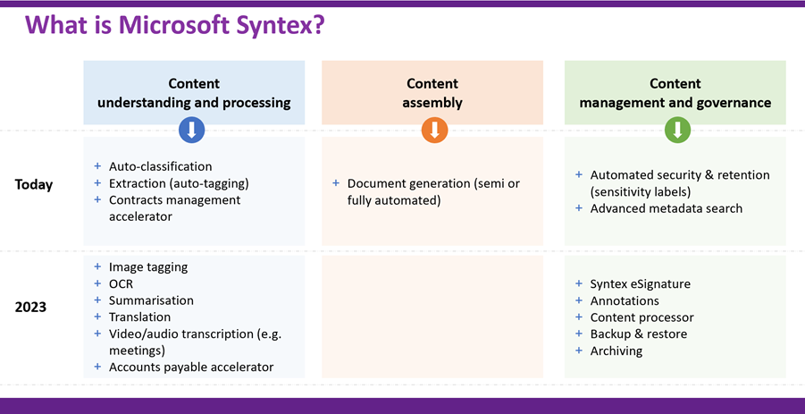

# Viva Topics

## Overview

- [Introduction to Viva Topics](https://www.mcd79.com/2021/02/06/Knowledge-Management-Series-Introduction-to-Viva-Topics.html)
- [Build an ever-growing Corporate Knowledge Base with Microsoft Viva Topics : An Overview](https://asishpadhy.com/2021/04/29/build-an-ever-growing-corporate-knowledge-base-with-microsoft-viva-topics-part-1/)

## Learning

- [Project Cortex - classifiers](https://www.sharepointnutsandbolts.com/2020/12/)
- [Project Cortex - entity extractors](https://www.sharepointnutsandbolts.com/2021/03/syntex-tips-document-understanding-forms-processing.html)
- [Syntex-Tips-document-understanding-forms-processing](https://www.sharepointnutsandbolts.com/2021/03/syntex-tips-document-understanding-forms-processing.html)
- [Syntex on a page - December 2022](https://www.sharepointnutsandbolts.com/2022/11/Microsoft-Syntex-compilation.html)
- [Understanding classifiers in Microsoft Syntex and Microsoft Purview](https://wbaer.net/2023/04/understanding-classifiers-in-microsoft-syntex-and-microsoft-purview/)
- [Microsoft Syntex: An AI-Powered SharePoint Content Service in Microsoft 365](https://o365reports.com/2023/05/18/microsoft-syntex-an-ai-powered-sharepoint-content-service-in-microsoft-365/)

(Source: @ChrisO_Brien)

 ## Tools

 - [Microsoft 365 Assessment tool](https://pnp.github.io/pnpassessment/index.html)
